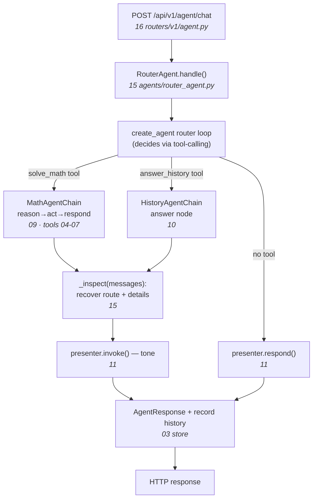

# Codebase walkthrough — index & map

A guided, dependency-ordered tour of **every AI-agent-related source file**: the shared
primitives, the math tools, the stateless chains, the orchestrating agents, and the HTTP
wiring.

The app runs in **one process**: a router built with LangChain's `create_agent` exposes
the math and history specialists as **tools** and calls them in-process; each specialist
is its own **LangGraph** `StateGraph`; a presenter restyles the result for tone. Each
linked doc explains **one** source file, block by block, with the design reasoning
(WHAT / WHY it's needed / WHY this construct over the alternative) and honest ⚠ PROD flags.

Read top to bottom: every file only relies on concepts introduced earlier.

## Reading path

**Primitives — the shared vocabulary every agent uses**

| # | Doc | Source | Why here |
|---|-----|--------|----------|
| 01 | [schema/agent](01-schema-agent.md) | `app/schema/agent.py` | The Pydantic result/response contracts every layer speaks. Pure leaf. |
| 02 | [utility/llm](02-utility-llm.md) | `app/utility/llm.py` | `get_llm()` — the provider factory every agent/chain builds its model from. |
| 03 | [utility/history](03-utility-history.md) | `app/utility/history.py` | `ChatHistoryStore` — the conversation memory the router owns. |

**Tools — what the math agent can call**

| # | Doc | Source | Why here |
|---|-----|--------|----------|
| 04 | [tools/calculator](04-tools-calculator.md) | `app/tools/calculator.py` | Safe AST arithmetic tool. |
| 05 | [tools/math_helpers](05-tools-math_helpers.md) | `app/tools/math_helpers.py` | Number-theory / statistics tools. |
| 06 | [tools/symbolic](06-tools-symbolic.md) | `app/tools/symbolic.py` | SymPy solve/diff/integrate/simplify tools. |
| 07 | [tools/__init__](07-tools-init.md) | `app/tools/__init__.py` | The `MATH_TOOLS` registry bound to the math agent. |

**Chains — the stateless specialists**

| # | Doc | Source | Why here |
|---|-----|--------|----------|
| 08 | [chain/base](08-chain-base.md) | `app/chain/base.py` | The `BaseChain.invoke()` contract all specialists implement. |
| 09 | [chain/math_agent](09-chain-math_agent.md) | `app/chain/math_agent.py` | Math specialist: explicit `reason → act → respond` LangGraph. |
| 10 | [chain/history_agent](10-chain-history_agent.md) | `app/chain/history_agent.py` | History specialist: minimal single-node LangGraph. |
| 11 | [chain/presenter_agent](11-chain-presenter_agent.md) | `app/chain/presenter_agent.py` | The in-process tone step + `respond()` fallback. |

**Agents — the orchestrators**

| # | Doc | Source | Why here |
|---|-----|--------|----------|
| 12 | [agents/base](12-agents-base.md) | `app/agents/base.py` | The `BaseAgent` contract; the orchestrator/chain split. |
| 13 | [agents/openai_agent](13-agents-openai_agent.md) | `app/agents/openai_agent.py` | A concrete single-shot `BaseAgent` (not in the chat flow). |
| 14 | [chain/graph](14-chain-graph.md) | `app/chain/graph.py` | `SimpleGraphChain` — a minimal LangGraph example wrapping an agent. |
| 15 | [agents/router_agent](15-agents-router_agent.md) | `app/agents/router_agent.py` | The `create_agent` router: specialists-as-tools + presenter. |

**HTTP**

| # | Doc | Source | Why here |
|---|-----|--------|----------|
| 16 | [routers/agent](16-routers-agent.md) | `app/routers/v1/agent.py` | Constructs and exposes the agents as endpoints. |

## Request lifecycle — who owns each hop

Everything speaks the contracts from docs 01 and 08, builds its model via doc 02, and —
for the router — remembers via doc 03. Docs 13 and 14 are agent-shaped code *outside* the
`/chat` flow, included for completeness.

Start at [01-schema-agent.md](01-schema-agent.md).
